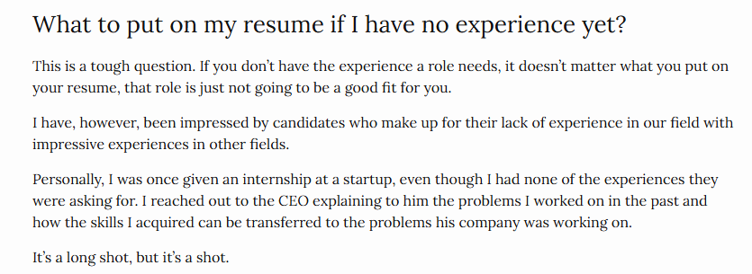

# Third week MLE-Curriculum

For this week we will leave the technical part to the side to focus on build your ideal resume, we will be designing our ideal resume, it doesn't matter if you are a beginner or an expert, we will be working on the resume to get the job you want. Ideally, this resume will be your target goal to achieve and it will be the resume that will get you in to your dream job, this helps to focus our minds into the direction you want to go.

The resume we built here can change as we learn things and gain experience, but this would be our target goal, you can look for inspiration online to find the profile that suits better to your needs, I want you to go as crazy as possible built your ideal resume, the one that no one can say no to you.

## Resume

Your first task is to go to this blog by Chip Huyen and follow the principles she use to built your resume

[What we look for in a candidate](https://huyenchip.com/2023/01/24/what-we-look-for-in-a-candidate.html)

Be specific with the sections and put the profile that you will submitt to your dream company, this will be the resume that will get you in, so take your time to build it.

The only limitation will be the experience, you can put the experience you have, but the rest of the resume should be the one that will get you in. If you need help refer to the blog post.

## Look for a template

Use internet in your favor to built the template that you can use

[Engineering Resumes](https://www.reddit.com/r/EngineeringResumes/wiki/index/)

## Get to work

This video will help you to follow the guidelines and principles use by google to built your resume

[Create your resume for google](https://www.youtube.com/watch?v=BYUy1yvjHxE)

## Homework

**Chip Huyen blog**

1. According to the article, what does the company primarily look for in a resume?
   a) A long list of technical skills and keywords
   b) Demonstrated expertise and impact
   c) Extensive work experience at large tech companies
   d) Academic achievements and high GPAs

2. How does the company view metrics on resumes?
   a) They prefer resumes without any metrics
   b) They value any quantifiable metric, regardless of context
   c) They appreciate metrics that demonstrate business impact and the candidate's specific contribution
   d) They only care about metrics related to cost savings

3. Which of the following is NOT mentioned as a positive signal in a resume?
   a) Initiating and completing significant projects
   b) Consistently changing jobs every year
   c) Contributing to open-source projects
   d) Receiving internal company awards or promotions

4. According to the article, what is suggested for candidates who lack experience in the specific field they're applying to?
   a) Inflate their experience by exaggerating their roles in projects
   b) Focus solely on academic achievements and coursework
   c) Highlight transferable skills from impressive experiences in other fields
   d) Apply only to entry-level positions, regardless of the job description

**Google resume**
5. What are the general tips for writing a resume for Google?
   a) Use a creative and eye-catching format.
   b) Keep the format simple and consistent, use black ink, and include your contact information.
   c) Use a lot of technical jargon and buzzwords.

6. What are some tailored resume recommendations for business and engineering and technical roles?
   a) Use a lot of action verbs.
   b) Quantify your achievements.
   c) Highlight your technical skills.
   d) All of the above

[Link to the form](https://docs.google.com/forms/d/e/1FAIpQLSevZ93Mg5sUgEMzL2N1hpV8Bgsv_fQkF4MjwUqWwIse8oi-Ig/viewform)
